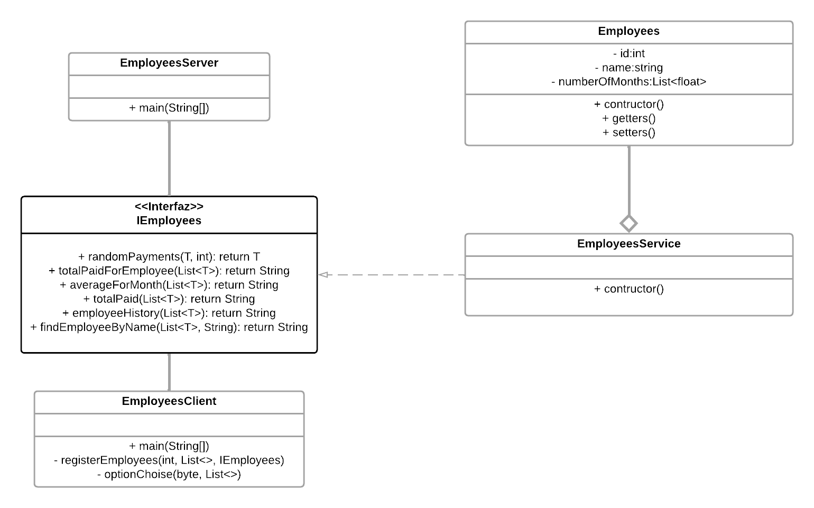

# Entrega Uno - Programación Distribuida y Paralela

## 1. Diagrama de Clases sobre RMI

---

## 2. Trabajo Independiente
- Implementación de un método para la visualización del historial detallado de los pagos de los meses por empleado.
- Implementación de un método de busqueda de empleados por medio del nombre.

---

## 3. Arquitectura Orientada a Servicios (SOA)

La Arquitectura Orientada a Servicios (SOA) es un estilo arquitectónico que organiza las aplicaciones como un conjunto de servicios independientes e interoperables que se comunican entre sí mediante interfaces bien definidas.

---

### Cuadro Comparativo de Ventajas y Desventajas de SOA

| **Aspecto**               | **Ventajas**                                                                 | **Desventajas**                                                             |
|----------------------------|------------------------------------------------------------------------------|-----------------------------------------------------------------------------|
| **Acoplamiento**           | Menor acoplamiento entre servicios, lo que permite mayor flexibilidad.       | Al estar desacoplados, la seguridad y el control pueden volverse más complejos. |
| **Reutilización**          | Los servicios pueden reutilizarse en múltiples aplicaciones y contextos.     | El diseño para la reutilización puede aumentar la complejidad inicial.      |
| **Escalabilidad**          | Facilita la escalabilidad horizontal de servicios específicos.               | Requiere mayor esfuerzo de coordinación y monitoreo para mantener eficiencia. |
| **Mantenibilidad**         | Facilita la actualización y mantenimiento de cada servicio de forma aislada. | Puede incrementar la dificultad de depuración al trabajar con múltiples servicios. |
| **Interoperabilidad**      | Promueve la integración entre aplicaciones heterogéneas (lenguajes, sistemas). | Diferencias tecnológicas pueden generar problemas de compatibilidad y rendimiento. |
| **Productividad**          | Permite mayor agilidad en el desarrollo y despliegue de soluciones.          | Necesidad de infraestructura adicional (orquestadores, brokers, etc.).     |

---

### Resumen

- **Ventaja Global:**  
  SOA ofrece **flexibilidad y escalabilidad**, permitiendo construir sistemas más modulares y adaptables a los cambios.

- **Desventaja Global:**  
  SOA implica **mayor complejidad y costos de gestión**, ya que requiere gobernanza, seguridad y monitoreo más rigurosos.

## Integrantes 

### Juan Camilo Alzate Bedoya
- [Perfil de Github](https://github.com/11JuanK11)
  
### Sara Carolina Sánchez Arroyave
- [Perfil de Github](https://github.com/Caro-26S)
